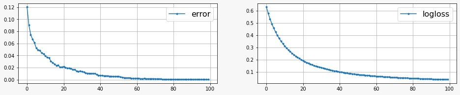
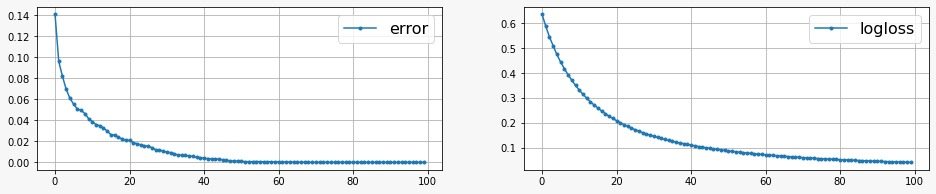

## KDTree + XGBoost Submission - Binary Image Classification Model for Poverty Map Dataset by WILDS

XGBoost stands for eXtreme Gradient Boosting. In this submission, the model is built on the base **KDTree + XGBoost** model given by the TA, for the given binary classification task. Multiple changes such as data split, multiple model training, feature addition, one hot encoding, etc. were made to improve the performance of the baseline model and get a higher accuracy. The major changes has been explained as follows:

### Trained the KD Tree on higher number of images
The KDTree was trained using a higher number of images, 1000 images, from the dataset. Also, the maximum depth of the tree was increased to 10. Then the whole dataset was encoded using this trained KDTree. After encoding, we finally got an increased number of features, that is, features.

### Addition of nightlight feature
The encoded data only had the information about the image but the dataframe also had additional information about the nightlight mean (given as `nl_mean`) and country labels. So, we added nightlife as a feature in the encoded data.

### One-Hot Encoding for the Countries
We used the *sklearn* library's `OneHotEncoder`, that encodes categorical features as a one-hot numeric array, to encode the Countries in our dataset. The features are encoded using a one-hot (aka ‘one-of-K’ or ‘dummy’) encoding scheme. This creates a binary column for each category and returns a sparse matrix or dense array.

### Split Data into Urban and Rural and run separate models
One of the major additions was splitting the data depending on the `Urban` and `Rural` categories. Then, we run two separate models, model_urban and model_rural, for the two categories of data. This is done because both urban and rural images have different threshold values to determine if it's poor or wealthy. Separating them into two data sets allows the models to learn different patterns for each case, resulting in better trained models.

### Tuning the hyperparameters
The model has also been tuned by varying multiple hyperparameters to get a higher accuracy with the best set of hyperparameters. Some of those are as follows:

##### Training split hyperparameter
For hyperparameter tuning, we split the data into a `80 (training): 20 (valid)` data split.

##### XGBClassifier Hyperparameters
We got these optimal hyperparameters for our model. Specifically, changing the following hyperparameters:

- train_ratio: 0.9
- ensemble_size: 20
- max_depth: 10
- eta: 0.01
- verbosity: 0
- objective: 'binary:logistic'
- nthread: 7
- eval_metric: ['error', 'logloss']
- num_round': 100
- gamma: 0.1
- subsample: 1
- min_child_weight: 3
- alpha: 0
- seed: 0

For each model, we ran the code for 20 iterations. Then, we kept the maximum depth of the tree as 10 for both models since keeping this value as too high can lead to overfitting. Then, the learning rate we use in our model is 0.01 as the higher learning rate of 0.3 does not fit the model very well. The loss function to be minimized has been used as the binary:logistic that is, logistic regression for binary classification, which returns predicted probability (not class). This is preferably used for a binary classification problem. The evaluation metrics used for the model are the negative log likelihood, and binary classification error rate. We tuned the hyperparameter gamma to be 0.1 which specifies the minimum loss reduction required to make a split. For inducing regularization, we have used the alpha hyperparameter which tunes the L1 regularization. Also, we kept a seed value in order to reproduce the results.

## Training
- Urban Model

- Rural Model

Once the model was hypertuned, then we trained the model on the whole dataset, removing the split. After training the model, the model was saved into a pickel file.

## Prediction
For prediciton, the testing data was divided into the two categories `urban` and `rural`. The two separate datasets were given to their respective models to predict the labels.
